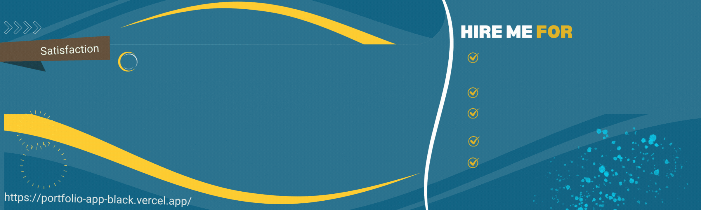

  

<h1 align="center">Hi 👋, I'm Aqeel Shahzad</h1>
<h3 align="center">A passionate JAMstack developer from  🇵🇰 Pakistan</h3>
<!-- 
c
<!-- <!-- Profile Statics  -->

  

<!-- <--

  
 
 -->

- 🔭 I’m currently working on **generative AI applications**

- 🌱 I’m currently learning **llms langchain**

- 👨‍💻 All of my projects are available at [https://portfolio-app-black.vercel.app/](https://portfolio-app-black.vercel.app/)

- 💬 Ask me about **I'm a passionate and experienced full-stack developer with expertise in Next.js, dedicated to creating elegant and functional web applications. My goal is to help you bring your projects to life and deliver solutions that meet your specific needs.**

- 📫 How to reach me **aqeelshahzad1215@gmail.com**

- 📄 Know about my experiences [https://portfolio-app-black.vercel.app/app](https://portfolio-app-black.vercel.app/app)

<!-- ************ (((( Github statics )))) ************* -->

<h2 align="center">GitHub Stats</h2>

<!-- Most used languages on the left and GIF image on the right -->

  
<!--    -->
  

<!-- First card on the left and the second on the right on the same line -->

  
  

<h3 align="center">Languages and Tools:</h3>

  <!-- Add your icons and links here -->
  
                               

  

    More about me
  

  <!-- Additional information or GitHub stats can go here -->
  <h3 align="center">Connect with me:</h3>
  

    
    
  

  <h3 align="center">Support:</h3>
  

    
  

